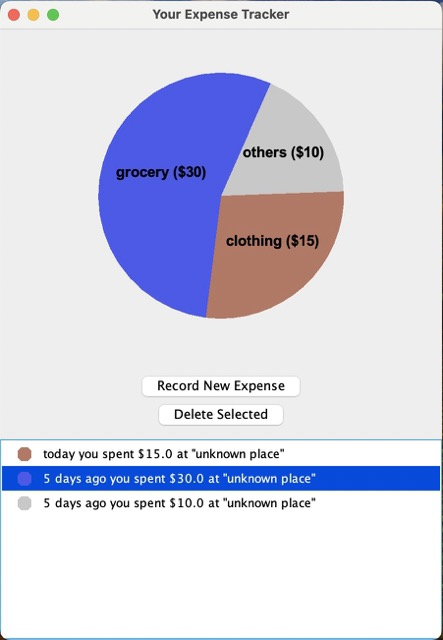

# My Personal Project

## Project Proposal
This project is an easy-to-use desktop expense tracker.
The user keeps track of their daily expenses by recording entries of
expenses into this application. All your expenses are organized into
categories such as grocery, clothing, or tuition, and pie chart summarizing your 
categorical expenses can be seen at the top of the main window.
Towards the bottom of the window, you can view a list of all expenses you have recorded. You can 
record a new expense by clicking on a "record" button, delete an expense by selecting it and clicking on
a "delete" button, or edit an expense by double-clicking on it in the expense list. 

Myself would be a potential user of this expense tracker. I have tried to
use similar expense tracking apps on my phone, but have found them to be
too complicated to use. I want to create a more customizable and simple
expense tracker that can let me clearly see all the important information on one
page. Anyone can use this application if they want an insight into their
spending habits.

## User Stories
### Expenses
- As a user, I want to be able to record an expense (eg. $10) and to set
  its amount, date, place, and category
- As a user, I want to be able to view a list of all expenses
- As a user, I want to be able to change the amount, date, place, and
  category of an expense
- As a user, I want to be able to delete an expense

### Categories
- As a user, I want to be able to create a new category with a chosen label
- As a user, I want to be able to change the label of a category
- As a user, I want to be able to view a list of all categories and to see a
  list of expenses in each category
- as a user, I want to be able to see the percentage and amount of money I spent in
  each category
- As a user, I want to be able to delete a category

### Data Persistence
- As a user, when I select the quit option from the main menu, I want to be
  reminded to save my expenses and categories to file and have the option to
  do so or not
- As a user, when I start the application, I want to be given the option to
  load my expenses and categories from file

## Instructions for Grader
### Action One
**To add an expense to a category**, you can either
click on the "Record New Expense" button in the main window to record a new expense in the desired category,
or double-click on any existing expenses in the list to change its category to the desired category.
In both cases, there will be a pop-up dialog, where you can enter the desired amount, date, place (optional),
and the category into the corresponding text fields.
The category field allows you to either enter the
label of a new category or select an existing category from the combo box. When you enter a new category label, 
if you are recording a new expense, then a new category with the label is created; but if you are editing an
existing expense, then the label of that expense's category will be changed to the one you entered (and no new
category is created).
Once you have entered or selected the desired category,
click the finish button to record your changes. Note that all expenses in the expense list will always be ordered
chronologically from latest to earliest according to their dates and times.

### Action Two
**To delete an expense**, select an expense from the expense list, then click on the "Delete Selected" button.
The selected expense will disappear from the list.

### Visual Component
The pie chart that summarizes your categorical expenses is at the top of the main window. It will update
whenever you make changes to the expense list.

### Load Data
To load data from file, choose the "yes" option when prompted on startup.

### Save Changes
To save changes, choose the "yes" option when prompted on quitting.

## Phase 4
### Task 2 (Sample Event Log)
Mon Nov 27 18:42:33 PST 2023  
Category created: others

Mon Nov 27 18:42:39 PST 2023  
Expense recorded/edited: $10.0

Mon Nov 27 18:42:48 PST 2023  
Category created: food

Mon Nov 27 18:42:48 PST 2023  
Expense of $20.0 added to category: food

Mon Nov 27 18:42:48 PST 2023  
Expense recorded/edited: $20.0

Mon Nov 27 18:42:51 PST 2023  
Expense of $20.0 removed from category: food

Mon Nov 27 18:42:51 PST 2023  
Expense deleted: $20.0

Mon Nov 27 18:42:51 PST 2023  
Expense deleted: $10.0

### Task 3 (Reflection and Refactoring)
If I have more time, I will refactor the way how the "categoryOfNoCategory" in my program is handled. 
categoryOfNoCategory is of type Category, and it represents a trash-bin Category that contains all the
expenses without a category. When an expense is not yet assigned a category when it was initially created,
it is in the categoryOfNoCategory by default, so Each expense must know about the categoryOfNoCategory.
Also, there can be one and only one categoryOfNoCategory in the whole program. 
Currently, I am just creating the categoryOfNoCategory as a normal category with a special label 
in the constructor of the ExpenseTracker.
It is passed as a parameter to Every new expense created. I even have a getter for it,
so that it can be frequently accessed from the ui package.

After learning the Singleton design pattern, I realized it can be used to greatly improve my design.
I can make a CategoryOfNoCategory class that extends Category and implements the Singleton pattern.
This way, I can just call CategoryOfNoCategory.getInstance() whenever I need to access it,
and there's no need to pass the categoryOfNoCategory to all the expenses or to pass it all around in the ui.